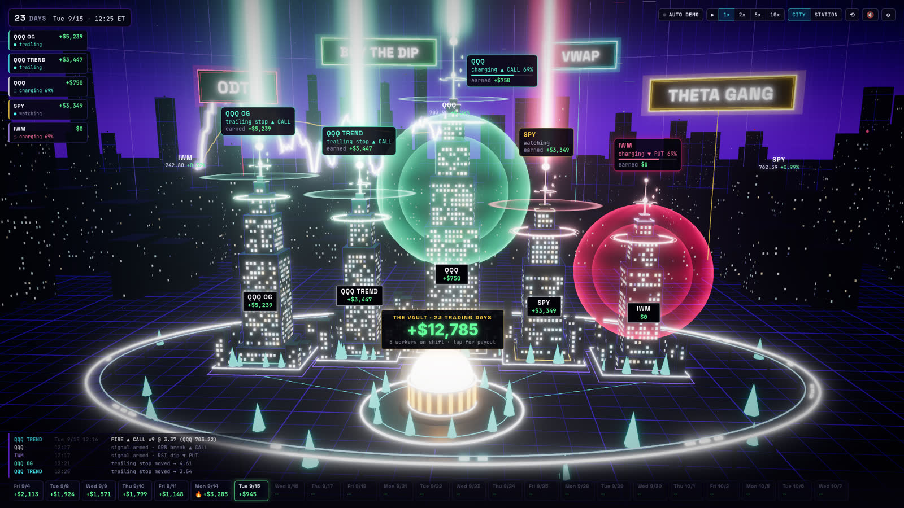
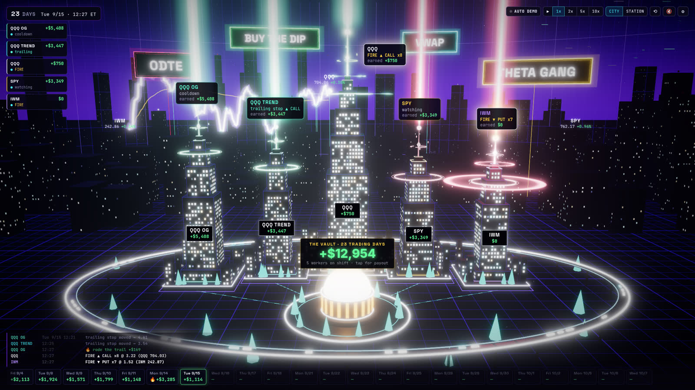
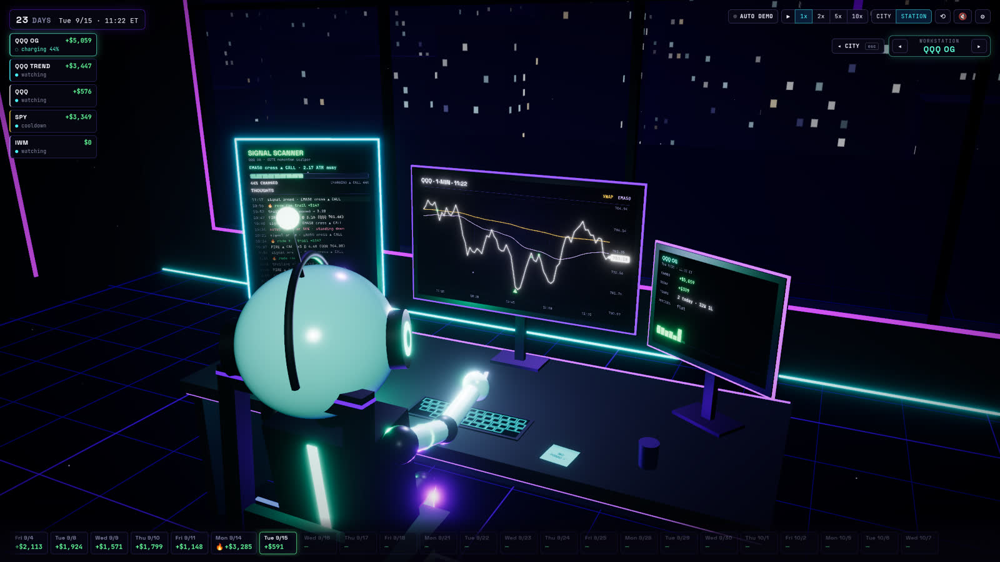
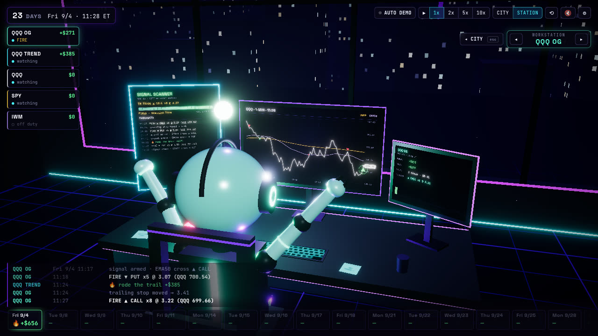
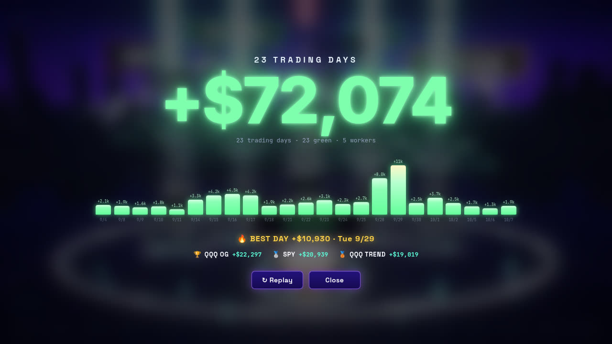

# Neon Trading City

An interactive, animated 3D visualization of a team of automated options-trading bots.
Every bot is a **worker**, and every worker is a **skyscraper** in a miniature cyberpunk
financial district at night. Workers watch the tape, **charge up** (a giant translucent
energy sphere: mint for CALL setups, magenta for PUT) as their setup gets close, **fire**
a towering light beam when they take a trade, and send realized profit into **the vault**
at the centre of the city. You can step inside any worker's **workstation** to watch a
little robot read its chart, scanner and "thoughts". A run ends on a **performance summary**.

Opened inside claude.ai, the city goes **live**. Three towers are wired to real desks:
VolX, the Robinhood SPX bot and your own Robinhood trading
([see Live city](#live-city)). Anywhere else, it replays a deterministic 23-day demo
run that needs no API keys or brokerage account. Any other bot or market feed can drive
it too ([see below](#plugging-in-live-bots--market-data)).



| Trade fires | Workstation |
| --- | --- |
|  |  |
| **Robot celebrating a FIRE** | **Performance summary** |
|  |  |

## Quick start

Requires Node 20+ (tested with Node 22).

```bash
npm install
npm run dev        # http://localhost:5173
```

| Script | What it does |
| --- | --- |
| `npm run dev` | Vite dev server with hot reload |
| `npm run build` | Typecheck (`tsc -b`) + production build into `dist/` |
| `npm run preview` | Serve the production build |
| `npm run typecheck` | TypeScript only |
| `npm test` | Vitest suite (simulation, reducer, director, live-event parsing) |

## What you're looking at

**The city.** Five worker towers stand left to right: `QQQ OG`, `QQQ TREND`, `QQQ` (the
tallest), `SPY` and `IWM`. Each tower is built from stacked prisms with thousands of
instanced windows, orbital rings, a spire with a diamond ornament, and a beam emitter. A
black plaque on each tower shows its cumulative P&L. A floating status card shows its
live state: `watching`, `charging ▲ CALL 38%`, `FIRE ▼ PUT x7`, `trailing stop`, and so on.
In the foreground sit the glowing **vault** and its plaza, a looping illuminated rail with
data packets running clockwise, and cyan cone trees. In the background are the
`0DTE / BUY THE DIP / VWAP / THETA GANG` neon billboards, a purple skyline, and a huge
curved **market wall** where the day's QQQ price draws itself live, with trade entry
markers.

**A trade, start to finish:** `WATCHING → CHARGING (aura grows, spire pulses faster) → READY
(fast pulse) → FIRE (aura bursts and collapses, shockwaves, beam, sparks, flash light) →
MANAGING → TRAILING → profit (+$ pop-up, green packet flies into the vault, vault odometer
ticks up) → COOLDOWN → WATCHING`.

**The workstation.** The robot sits at a three-monitor desk in a purple night office:
- **SIGNAL SCANNER:** the setup, its distance in ATRs, a charge bar and a `THOUGHTS` log.
- **Main chart:** `QQQ · 1-MIN`, with white price, yellow VWAP and lavender EMA50 lines,
  green/red entry markers, and a live price bubble.
- **Side panel:** position and P&L.

When its worker fires, the robot throws both arms up, its antenna flashes and the big red
button glows.

**The demo run** covers 23 trading days (Fri 9/4 → Wed 10/7, 2026). Every day is green and
the total is **+$72,074**:

| Worker | Total |
| --- | --- |
| QQQ OG | +$22,297 |
| SPY | +$20,939 |
| QQQ TREND | +$19,019 |
| QQQ | +$5,775 |
| IWM | +$4,044 |

The best day is **Tue 9/29, +$10,930**. All of these figures are enforced by tests.

### AUTO DEMO

The app opens in **AUTO DEMO**, a roughly 100-second cinematic replay that follows the
structure of the reference recording:

| Time | What happens |
| --- | --- |
| 0–6 s | QQQ OG's workstation |
| 6–26 s | The city |
| 26–38 s | Back inside a workstation, timed so that worker fires on camera |
| 38–96 s | An accelerated sweep through the remaining sessions |
| ~98 s | The summary |

Any manual interaction (dragging, clicking a tower, pressing a hotkey) hands control back
to you. The `AUTO DEMO` chip (or `A`) resumes it.

## Controls

| Input | Action |
| --- | --- |
| Drag / wheel | Orbit / zoom (clamped so the city can't be flipped or lost) |
| Hover tower | Highlight + pointer |
| Click tower | Focus the camera and open the worker detail card |
| Click focused tower / `Enter` / double-click | Fly into that worker's workstation |
| Click the vault (or its label) / `P` | Performance summary |
| `Esc` | Close summary → leave workstation → clear focus |
| `Space` | Pause / resume the simulation |
| `1`–`5` | QQQ OG, QQQ TREND, QQQ, SPY, IWM |
| `←` / `→` | Cycle workers |
| `A` | Toggle AUTO DEMO |
| `M` | Sound on/off (subtle synthesized hum, pulse and chime; **muted by default**) |
| `R` | Reset camera |
| `` ` `` | Simulation controls panel |

The **⚙ simulation controls** panel (top right, hidden by default) has Play/Pause,
1x/2x/5x/10x, Reset, Trigger CALL, Trigger PUT, End Day, Skip to End and Show Summary.
These are useful for exercising every animation on demand.

URL options:

| Option | Effect |
| --- | --- |
| `?demo=0` | Start in manual mode (no auto demo) |
| `?quality=low` / `?quality=high` | Force the render quality tier (low = no MSAA, lighter bloom, fewer particles; picked automatically for small or low-core devices) |
| `?scene=station` | Open in the workstation |
| `?debug=1` | Open the simulation controls panel |
| `?ws=wss://…` / `?sse=https://…` | Live mode (below) |

## Architecture

```
src/
  app/          App shell, rAF simulation loop, auto-demo director, scene transitions,
                keyboard, audio, UI store
  scenes/       Canvas root (postprocessing, fog), TradingCityScene, WorkerStationScene
  three/        Procedural 3D: towers (+ spire, aura, beam), vault, track, skyline,
                billboards, market wall, robot, desk, canvas-texture monitors, camera rig,
                shared shaders/materials, per-frame tower FX driver
  ui/           DOM HUD: top HUD, status cards & plaques, vault label, timeline, ticker,
                detail card, controls, debug panel, summary, loading screen
  simulation/   Deterministic engine, schedule builder, market generator, reducer,
                zustand stores, live-data adapters, P&L helpers
  data/         Worker config, demo-run targets, ticker profiles
  types/        Domain types + the BotEvent protocol
```

**Data flow:** everything the UI shows comes from one event stream.

```
SimulationEngine ─┐                                   ┌─► DOM HUD (React, narrow selectors)
WebSocket / SSE ──┼─► BotEvent[] ─► reduceEvents() ─► useSim store
(liveSources.ts) ─┘                 (pure, tested)    └─► towerFx (once per frame) ─► towers,
                                                          auras, beams, lights, robot, audio
```

- `SimulationEngine` advances a clock in session minutes. It emits `CLOCK`, `SESSION`,
  `MARKET_TICK`, `MARKET_BAR`, `BOT_STATUS`, `TRADE_EXECUTED`, `TRADE_CLOSED` and
  `THOUGHT` events, which is exactly what a live backend would send.
- `reduceEvents` is a pure reducer. A single `TRADE_CLOSED` updates the worker P&L, vault,
  day card, chart markers, ticker, thoughts and effect counters together, so everything
  stays in sync.
- `towerFx` derives smoothed, real-time effect state (aura size, beam envelope, pulse,
  flash) once per frame. Every 3D effect reads from it, rather than each running its own
  animation loop. Envelopes use real time, so beams and auras still read clearly during
  10x fast-forward.
- Minute bars go into a non-reactive ring buffer (`marketBuffer`) that the chart wall and
  monitors read inside their render loops, so React never re-renders per bar.
- The demo schedule is generated deterministically. It balances an exact day × worker P&L
  matrix, splits each cell into trades, and places each trade where the underlying
  actually moves in its favour, so chart markers always agree with the price line.

Rendering notes: buildings are procedural boxes with instanced windows (one draw call per
district) and a twinkle shader. Bloom only picks up HDR emissives, followed by ACES tone
mapping and a vignette. Labels are drei `Html` anchored in world space. Monitor screens are
`CanvasTexture`s, so they bloom and are depth-correct behind the robot. Both scenes use the
same light layout, so switching scenes never triggers shader recompiles. DPR is capped at
1.5. `prefers-reduced-motion` disables camera drift, twinkle, bobbing and beam flicker.

## Live city

When the page runs inside claude.ai (`window.claude` exists), it starts in live mode.
The `#demo` link anchor switches back to the demo run; the FEEDS panel has the same
switch. `#live` forces live mode, for example in local dev.

| Tower | Source | How it gets there |
| --- | --- | --- |
| **VOLX** (left, `PAPER`) | VolX desk: MES vol breakout plus MNQ/MCL overnight, IB paper | the local [`volxdesk` bridge](bridge/README.md) on the desk PC; elsewhere, the last copy it synced to the page's database |
| **SPX BOT** | the agent-traded Robinhood account (XSP 0DTE credit spreads) | the viewer's claude.ai Robinhood connector, read-only |
| **MY ROBINHOOD** (middle) | the owner's default Robinhood account | same connector |
| SPY, IWM | nothing yet | dark, `OFFLINE`, no P&L |

- **The vault** holds realized P&L since **Tue 10/6/2026** (`LIVE_START` in
  `src/live/config.ts`), with no earlier history. It is VolX paper P&L plus both
  Robinhood accounts, as Robinhood's P&L hub and the desk booked it. Days come from the
  NYSE calendar in America/New_York time.
- **FIRE:** an opening fill makes the tower fire. Legs filled within 90 s count as one
  trade, so a credit spread placed as two orders fires once. A short put or long call
  reads bullish (mint); a short call or long put reads bearish (magenta). VolX fires on
  its breakout entry (BUY = mint, SELL = magenta).
- **Charge:** VolX charges toward whichever resting breakout stop the MES price is
  nearer, as a percentage of the breakout width. The Robinhood towers have no signal
  to show, so they watch while flat and manage while a position is open.
- **Charts:** SPX (no volume, so no VWAP), QQQ and MES 1-minute bars. Before the open
  and on weekends they show the last session.
- **Read-only:** the page declares only these Robinhood tools: `get_accounts`,
  `get_option_orders`, `get_pnl_trade_history`, `get_index_historicals` and
  `get_equity_historicals`. From the bridge it uses `desk_events`. Nothing can place,
  change or cancel an order.
- The code lives in `src/live/`. The pure mappers (`robinhood.ts`, `volx.ts`,
  `marketClock.ts`) are unit-tested. `runner.ts` merges feeds into the same `BotEvent`
  stream the demo engine produces.

## Plugging in live bots / market data

The UI consumes the `BotEvent` protocol (`src/types/trading.ts`). Start the app with
`?ws=wss://your-host/events` or `?sse=https://your-host/events`. The demo engine then
idles and the backend drives the UI. Messages can be a single JSON event or an array of
them. Keys may be camelCase or snake_case. Examples:

```json
{"type":"RUN_INIT","days":[{"date":"2026-09-14","label":"Mon 9/14"}]}
{"type":"SESSION","dayIndex":0,"phase":"open"}
{"type":"CLOCK","dayIndex":0,"minute":13}
{"type":"MARKET_TICK","ticker":"QQQ","timestamp":13,"price":708.81}
{"type":"MARKET_BAR","ticker":"QQQ","point":{"timestamp":13,"price":708.81,"vwap":708.2,"ema50":707.9}}
{"type":"BOT_STATUS","workerId":"qqq-trend","status":"charging","direction":"CALL","charge":68}
{"type":"TRADE_EXECUTED","workerId":"qqq-og","ticker":"QQQ","direction":"CALL","contracts":7,"entry":3.53,"underlying":715.80}
{"type":"TRADE_CLOSED","workerId":"qqq-og","pnl":161}
{"type":"THOUGHT","workerId":"qqq-og","text":"trailing stop moved → 3.71","tone":"info"}
```

- Worker ids: `qqq-og`, `qqq-trend`, `qqq`, `spy`, `iwm`. Edit `src/data/workers.ts` to
  rename, recolour or reposition towers.
- Statuses: `watching | scanning | charging | ready | firing | managing | trailing |
  cooldown | off-duty`.
- Missing day/minute/timestamp fields default to the current clock. Malformed messages are
  dropped, never thrown.
- Programmatic use: `connectSource(new WebSocketEventSource(url))`,
  `new SSEEventSource(url)`, or `new MarketTickSource(provider)` to adapt any
  `MarketDataProvider`.

A minimal Python bridge for an existing bot:

```python
import asyncio, json, websockets

clients = set()

async def handler(ws):
    clients.add(ws)
    try:
        await ws.wait_closed()
    finally:
        clients.discard(ws)

async def publish(event: dict):
    websockets.broadcast(clients, json.dumps(event))

# inside your bot:
#   await publish({"type": "BOT_STATUS", "workerId": "spy", "status": "charging", "direction": "PUT", "charge": 81})
#   await publish({"type": "TRADE_EXECUTED", "workerId": "spy", "ticker": "SPY", "direction": "PUT", "contracts": 5, "entry": 2.41, "underlying": 763.8})
#   await publish({"type": "TRADE_CLOSED", "workerId": "spy", "pnl": 412})

async def main():
    async with websockets.serve(handler, "0.0.0.0", 8765):
        await asyncio.Future()

asyncio.run(main())
```

Then open `http://localhost:5173/?ws=ws://localhost:8765`.

This integration is read-only by design. Nothing in this app places, modifies or cancels
orders.

## Testing

`npm test` runs six suites:

- **Simulation:** determinism; exact per-worker and per-day totals; the best day; a
  stronger last third; non-overlapping worker timelines; trade direction agreeing with
  the price move; a full replay through the reducer landing on +$72,074 at any step size;
  the status lifecycle; injected trades (and refusals when a worker is busy, off duty or
  too close to the close); reset; end-day.
- **Reducer:** immutability, and consuming live-style events.
- **Auto-demo director:** the scene sequence and beats; a FIRE on camera during the
  workstation visit; finishing near 96 s; the summary opening; mid-run resume.
- **Live parsing:** the documented payloads, snake_case input, and malformed input.
- **Transitions:** fly-out → swap → settle, no restart on key repeat, redirect mid-flight.
- **Live city:** ET/DST math and the session calendar; Robinhood spreads firing once; P&L
  rows grouped per close, ignoring anything before the start; position until expiry;
  VolX charge, fire, close and cooldown; the runner ingesting each event once and
  topping up a deposit that grows between polls.

## Notes

- The reference screen recording wasn't available in the repository, so the scene was
  built from the written specification of that recording.
- The 3D models are all procedural (no downloaded assets). Fonts (Inter, Space Grotesk,
  JetBrains Mono) are bundled locally via `@fontsource`.
